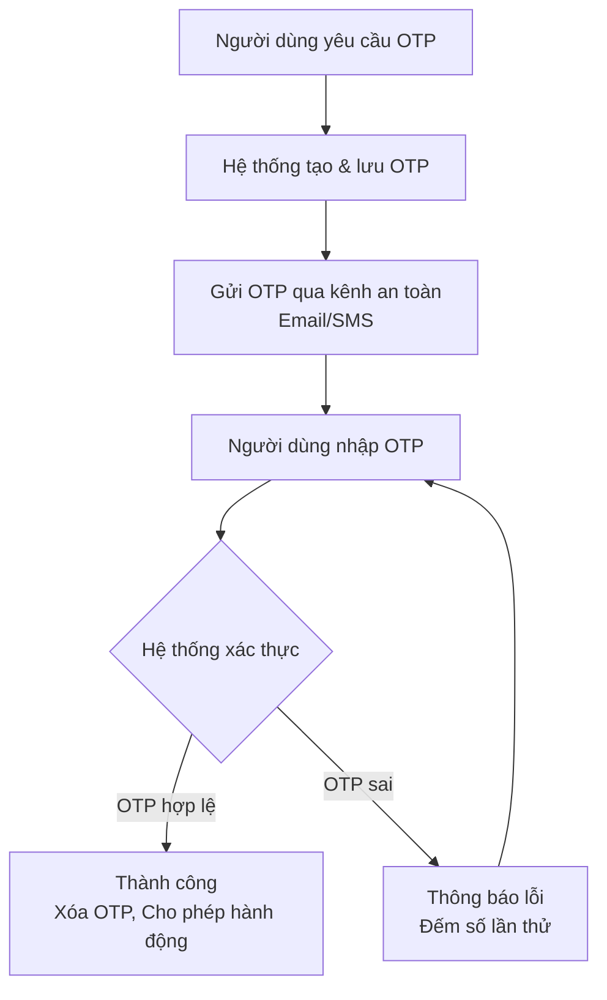

### Tổng quan về OTP Flow

Luồng OTP là một chuỗi các bước được thiết kế để xác thực danh tính người dùng bằng cách sử dụng một mật khẩu chỉ có hiệu lực một lần và trong một khoảng thời gian ngắn. Mục tiêu chính là **tăng cường bảo mật** cho các hành động nhạy cảm như đăng nhập, đặt lại mật khẩu, hoặc xác nhận giao dịch.

Dưới đây là sơ đồ luồng cơ bản nhất:

---

### Phân tích chi tiết từng bước

#### Bước 1: Người dùng kích hoạt yêu cầu OTP

- **Hành động:** Người dùng thực hiện một hành động cần xác thực (ví dụ: nhấn "Đăng nhập", "Quên mật khẩu", "Xác nhận giao dịch").
- **Dữ liệu cần thiết:** Hệ thống cần thu thập một định danh duy nhất để gửi OTP, thường là:
  - Số điện thoại (cho SMS)
  - Địa chỉ email (cho Email)
  - Username hoặc ID tài khoản.

#### Bước 2: Hệ thống tạo và lưu trữ OTP

Đây là bước quan trọng về mặt kỹ thuật và bảo mật.

1. **Tạo mã OTP:**
    - **Độ dài:** Thường từ 4 đến 6 chữ số (với SMS) hoặc 6-8 ký tự chữ và số (với email/ứng dụng). Độ dài cần cân bằng giữa tính bảo mật và trải nghiệm người dùng.
    - **Tính ngẫu nhiên:** Mã phải được tạo ra bằng một thuật toán ngẫu nhiên mạnh (Cryptographically Secure Random) để tránh bị dự đoán.
    - **Thời gian hiệu lực (Expiry):** Mỗi OTP phải có một thời gian sống ngắn, thường là **60-180 giây**. Điều này giảm thiểu rủi ro nếu mã bị đánh cắp.

2. **Lưu trữ OTP:**
    - **Cơ sở dữ liệu:** OTP (hoặc hash của OTP) được lưu vào database cùng với các thông tin meta:
        - `user_id` hoặc `identifier` (email/số điện thoại).
        - `otp_code`: **Tốt nhất nên lưu dưới dạng hash** (giống như mật khẩu) để đề phòng DB bị rò rỉ.
        - `created_at`: Thời điểm tạo.
        - `expires_at`: Thời điểm hết hạn.
        - `attempts`: Số lần thử nhập sai (mặc định là 0).
    - **In-Memory Cache (Ưu việt hơn):** Sử dụng các hệ thống như Redis, Memcached là lựa chọn tốt hơn vì:
        - **Hiệu suất cao.**
        - Có thể thiết lập **TTL (Time-To-Live)**, OTP sẽ tự động bị xóa khi hết hạn, không cần job dọn dẹp.

#### Bước 3: Gửi OTP đến người dùng

- **Kênh gửi:**
  - **SMS:** Phổ biến nhất nhưng có nguy cơ bị tấn công SIM Swap.
  - **Email:** Phù hợp cho các dịch vụ web.
  - **Ứng dụng Authenticator (Google/Microsoft Authenticator):** Sinh OTP dựa trên thuật toán TOTP, an toàn hơn vì không phụ thuộc vào mạng viễn thông.
  - **Voice Call (ít phổ biến):** Gọi điện thoại và đọc mã OTP.
- **Yêu cầu:** Quá trình gửi phải nhanh chóng và đáng tin cậy. Hệ thống thường tích hợp với các nhà cung cấp dịch vụ SMS/Email (như Twilio, SendGrid, AWS SNS/Pinpoint).

#### Bước 4: Người dùng nhập OTP

- Người dùng nhận mã và nhập vào form đã hiển thị trên ứng dụng/website.
- UI/UX nên có:
  - Bộ đếm ngược thời gian hiệu lực.
  - Nút "Gửi lại OTP" (sau một khoảng thời gian chờ, ví dụ 30s).

#### Bước 5: Hệ thống xác thực OTP

Hệ thống thực hiện kiểm tra theo trình tự sau:

1. **Kiểm tra định danh:** Tìm OTP được lưu trữ dựa trên `user_id` hoặc `identifier` (số ĐT/email) mà người dùng đang thực hiện xác thực.
2. **Kiểm tra số lần thử:** Nếu số lần nhập sai (`attempts`) vượt quá ngưỡng cho phép (thường là 3-5 lần), OTP sẽ bị vô hiệu hóa ngay lập tức và người dùng phải yêu cầu mã mới. Điều này ngăn chặn tấn công brute-force.
3. **Kiểm tra thời hạn:** So sánh thời điểm hiện tại với `expires_at`. Nếu OTP đã hết hạn, quá trình xác thực thất bại.
4. **Kiểm tra mã:** So sánh mã OTP người dùng nhập với mã đã lưu trữ (sau khi hash nếu cần). Phép so sánh phải chống lại timing attack.

#### Bước 6: Xử lý kết quả và Dọn dẹp

- **Nếu thành công:**
  - Hệ thống **XÓA** OTP khỏi cache/database ngay lập tức. Đảm bảo mã không thể sử dụng lại (Replay Attack).
  - Cho phép người dùng thực hiện hành động tiếp theo (đăng nhập, đặt lại mật khẩu, v.v.).
  - Có thể tạo một phiên (session) hoặc token mới.

- **Nếu thất bại:**
  - Tăng biến `attempts` lên 1.
  - Thông báo lỗi chung chung cho người dùng: "Mã OTP không đúng hoặc đã hết hạn". *Không* nên tiết lộ chi tiết là sai mã hay hết hạn để tránh leak thông tin.
  - Cho phép người dùng thử lại hoặc yêu cầu gửi mã mới.

---

### Các yếu tố bảo mật cần lưu ý

1. **Tính duy nhất và một lần:** Một OTP chỉ được sử dụng đúng một lần.
2. **Thời gian sống ngắn:** Giảm thiểu cửa sổ tấn công.
3. **Chống tấn công Brute-force:** Giới hạn số lần nhập sai.
4. **Bảo vệ kênh gửi:** Lựa chọn kênh gửi an toàn và có độ tin cậy cao.
5. **Lưu trữ an toàn:** Hash OTP trước khi lưu vào database.
6. **Chống tấn công Replay:** Vô hiệu hóa OTP ngay sau khi xác thực thành công.
7. **Rate Limiting:** Giới hạn số lần yêu cầu gửi OTP từ một địa chỉ IP/identifier trong một khoảng thời gian để tránh spam hoặc tấn công từ chối dịch vụ.

---

### Ví dụ minh họa: Flow "Đăng nhập bằng SĐT và OTP"

1. **User:** Nhập số điện thoại -> Nhấn "Gửi mã".
2. **Server:**
    - Kiểm tra SĐT có hợp lệ không.
    - Tạo mã OTP 6 số ngẫu nhiên, hết hạn sau 120s.
    - Lưu `hash(OTP)` + `số_điện_thoại` + `expiry_time` vào Redis với TTL=120s.
    - Gọi API của nhà cung cấp SMS để gửi mã đến SĐT.
3. **User:** Nhận SMS, nhập mã OTP vào app.
4. **Server:**
    - Tìm thông tin OTP trong Redis dựa trên SĐT.
    - Kiểm tra chưa vượt quá 5 lần thử.
    - Kiểm tra OTP chưa hết hạn.
    - So sánh `hash(OTP_nhập_vào)` với `hash(OTP_trong_Redis)`.
    - Nếu khớp:
        - Xóa bản ghi OTP trong Redis.
        - Tạo và trả về Access Token cho người dùng.
    - Nếu sai:
        - Tăng số lần thử lên. Nếu >=5, xóa luôn OTP.
        - Trả về lỗi.

Luồng OTP tuy đơn giản về mặt ý tưởng nhưng việc triển khai một cách chặt chẽ, bảo mật và thân thiện với người dùng đòi hỏi sự quan tâm đến từng chi tiết kỹ thuật.
