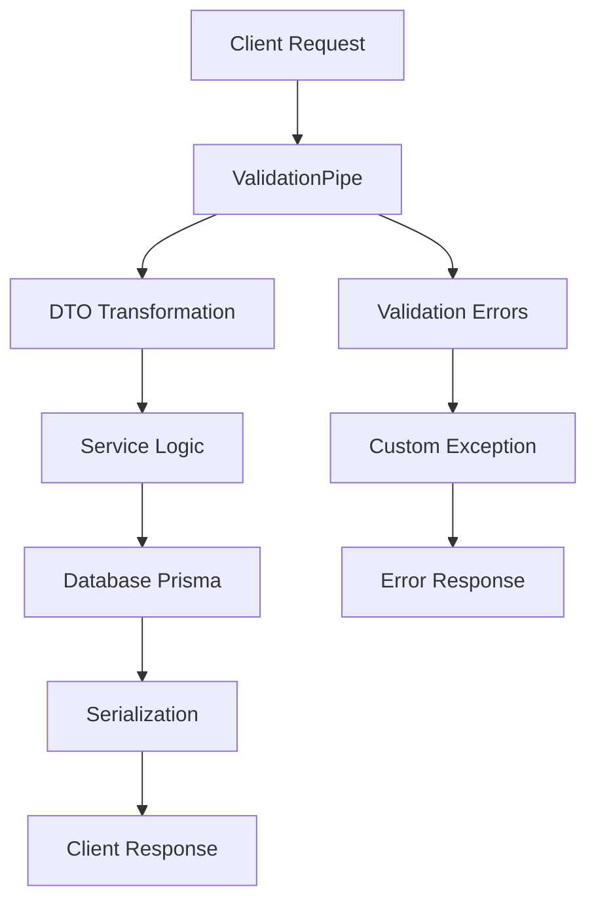

# 🚀 NestJS Concepts & Implementation Guide

## 📚 Core Concepts

### 🎯 **DTO (Data Transfer Object)**

```typescript
// DTO là mẫu thiết kế để truyền dữ liệu giữa các lớp/tầng trong ứng dụng
class CreateUserDto {
  email: string;
  password: string;
  name: string;
}
```

**Đặc điểm:**

- ✅ Đóng gói dữ liệu
- ✅ Truyền qua mạng
- ✅ Ẩn cấu trúc đối tượng gốc
- ✅ Tách biệt layers

### 🔧 **Service**

```typescript
@Injectable()
export class UserService {
  constructor(private prisma: PrismaService) {}
  
  async createUser(dto: CreateUserDto) {
    // Logic nghiệp vụ
  }
}
```

**Vai trò:**

- 🎯 Thực hiện chức năng cụ thể
- 🔄 Tách biệt logic nghiệp vụ
- ♻️ Tăng tính tái sử dụng
- 🛠️ Dễ bảo trì

### 🗄️ **Prisma ORM**

```typescript
// Thay vì SQL thủ công
const users = await prisma.user.findMany({
  where: { active: true }
});
```

**Lợi ích:**

- ⚡ TypeScript/JavaScript native
- 🔒 Type-safe database queries
- 🎯 Modern database access
- 📊 Auto-generated client

### 🔐 **Hashing Service**

```typescript
@Injectable()
export class HashingService {
  async hashPassword(password: string): Promise<string> {
    return bcrypt.hash(password, 12);
  }
  
  async comparePassword(password: string, hash: string): Promise<boolean> {
    return bcrypt.compare(password, hash);
  }
}
```

**Mục đích:**

- 🛡️ Bảo vệ mật khẩu
- 🔄 Chuyển đổi one-way
- 📏 Chuỗi cố định độ dài
- 🔒 Không thể khôi phục

### ❌ **Prisma Client Known Request Error**

```typescript
try {
  await prisma.user.create({ data: userData });
} catch (error) {
  if (error.code === 'P2002') {
    throw new ConflictException('Email already exists');
  }
  throw error;
}
```

**Common Error Codes:**

- `P2002` - Unique constraint violation
- `P2025` - Record not found
- `P2003` - Foreign key constraint failed

---

## 🎯 Decorators & Annotations

### 🏗️ **Constructor**

```typescript
export class UserController {
  constructor(
    private userService: UserService,
    private hashingService: HashingService
  ) {}
}
```

### 📦 **@Body()**

```typescript
@Post('register')
async register(@Body() createUserDto: CreateUserDto) {
  return this.userService.create(createUserDto);
}
```

### 📤 **@Post('register')**

```typescript
@Controller('auth')
export class AuthController {
  @Post('register')  // POST /auth/register
  async register(@Body() dto: CreateUserDto) {
    // Handle registration
  }
}
```

### 🔄 **@UseInterceptors(ClassSerializerInterceptor)**

```typescript
@Controller('users')
@UseInterceptors(ClassSerializerInterceptor)
export class UserController {
  @Get()
  async findAll(): Promise<UserDto[]> {
    // Auto-serialized to JSON
  }
}
```

---

## ⚙️ Validation & Transformation

### 🎯 **ValidationPipe Configuration**

```typescript
const app = await NestFactory.create(AppModule);

app.useGlobalPipes(
  new ValidationPipe({
    // 🎯 Cấu hình Validation
    whitelist: true,           // 🗑️ Loại bỏ thuộc tính thừa
    forbidNonWhitelisted: true, // ❌ Lỗi nếu có thuộc tính thừa
    transform: true,           // 🔄 Chuyển đổi payload thành DTO instance
    exceptionFactory: (errors) => {
      // 🎨 Custom error response
      return new UnprocessableEntityException(
        errors.map(err => ({
          field: err.property,
          errors: Object.values(err.constraints).join(', ')
        }))
      );
    }
  })
);
```

### 🚨 **UnprocessableEntityException**

```typescript
throw new UnprocessableEntityException({
  message: 'Validation failed',
  errors: [
    { field: 'email', error: 'Invalid email format' },
    { field: 'password', error: 'Password too weak' }
  ]
});
```

---

## 🔄 Serialization

### 🎯 **Chuyển đổi dữ liệu trước khi trả về client**

```typescript
// Entity -> DTO transformation
@Entity()
export class User {
  id: number;
  email: string;
  password: string;  // ❌ Sẽ bị ẩn
  createdAt: Date;
}

export class UserDto {
  id: number;
  email: string;
  createdAt: Date;
  // ✅ Chỉ trả về fields cần thiết
}
```

### 🛠️ **Class Transformer Decorators**

```typescript
import { Exclude, Expose, Transform, Type } from 'class-transformer';

export class UserResponseDto {
  @Expose()
  id: number;

  @Expose()
  email: string;

  @Exclude()  // 🚫 Ẩn password khỏi response
  password: string;

  @Expose()
  @Transform(({ value }) => value.toISOString()) // 🎨 Format date
  createdAt: Date;

  @Expose()
  @Type(() => ProfileDto) // 🔄 Transform nested object
  profile: ProfileDto;

  @Expose()
  get fullName(): string {  // 🎯 Computed property
    return `${this.firstName} ${this.lastName}`;
  }
}
```

---

## ✅ Validation Rules

### 📋 **Class Validator Decorators**

```typescript
import {
  IsString, IsEmail, IsNotEmpty, Length, 
  Min, Max, Matches, IsOptional, ValidateNested,
  IsArray, IsEnum, IsBoolean, IsUUID
} from 'class-validator';

export class CreateUserDto {
  @IsNotEmpty({ message: 'Email là bắt buộc' })
  @IsEmail({}, { message: 'Email không hợp lệ' })
  email: string;

  @IsString()
  @Length(6, 20, { message: 'Mật khẩu phải từ 6-20 ký tự' })
  @Matches(/(?=.*[a-z])(?=.*[A-Z])(?=.*\d)/, {
    message: 'Mật khẩu phải chứa chữ hoa, chữ thường và số'
  })
  password: string;

  @IsOptional()
  @IsString()
  @Length(2, 50)
  name?: string;

  @IsEnum(UserRole)
  role: UserRole;

  @IsArray()
  @ArrayMinSize(1)
  @ValidateNested({ each: true })
  @Type(() => ProfileDto)
  profiles: ProfileDto[];

  @IsBoolean()
  isActive: boolean;

  @IsUUID()
  companyId: string;

  @IsNumber()
  @Min(18)
  @Max(100)
  age: number;
}
```

### 🎯 **Common Validators**

| Decorator | Purpose | Example |
|-----------|---------|---------|
| `@IsString()` | Kiểm tra chuỗi | `name: string` |
| `@IsEmail()` | Validate email | `email: string` |
| `@IsNotEmpty()` | Không được rỗng | `password: string` |
| `@Length(min, max)` | Độ dài chuỗi | `@Length(3, 50)` |
| `@Min() / @Max()` | Giá trị số | `@Min(0) @Max(100)` |
| `@Matches(regex)` | Regex pattern | `@Matches(/^[a-z]+$/)` |
| `@IsOptional()` | Không bắt buộc | `optionalField?: string` |
| `@IsEnum()` | Enum value | `@IsEnum(UserRole)` |
| `@IsUUID()` | UUID format | `id: string` |
| `@IsArray()` | Kiểm tra mảng | `tags: string[]` |

---

## 🚀 Application Bootstrap

### 📦 **AppModule & Startup**

```typescript
import { NestFactory } from '@nestjs/core';
import { AppModule } from './app.module';
import { ValidationPipe } from '@nestjs/common';

async function bootstrap() {
  // 🏗️ Tạo ứng dụng NestJS
  const app = await NestFactory.create(AppModule);
  
  // ⚙️ Global Validation Configuration
  app.useGlobalPipes(
    new ValidationPipe({
      whitelist: true,           // 🗑️ Auto-remove unknown properties
      forbidNonWhitelisted: true, // ❌ Throw error for unknown properties
      transform: true,           // 🔄 Transform payload to DTO instances
      exceptionFactory: (validatorErrors) => {
        // 🎨 Custom validation error format
        const errors = validatorErrors.map(err => ({
          field: err.property,
          errors: Object.values(err.constraints).join(', '),
        }));
        
        return new UnprocessableEntityException({
          message: 'Validation failed',
          errors,
          timestamp: new Date().toISOString(),
        });
      },
    }),
  );

  // 🌐 Start listening on port
  const port = process.env.PORT ?? 3000;
  await app.listen(port);
  
  console.log(`🚀 Application running on: http://localhost:${port}`);
}

// 🎯 Bootstrap application
bootstrap().catch(console.error);
```

---

## 📝 Summary Table

| Concept | Purpose | Key Features |
|---------|---------|--------------|
| **DTO** | Data transfer between layers | Encapsulation, Type safety |
| **Service** | Business logic separation | Reusable, Maintainable |
| **Prisma** | Database ORM | Type-safe, Modern |
| **Hashing** | Password protection | One-way, Secure |
| **Validation** | Input data validation | Rules, Custom messages |
| **Serialization** | Data transformation | Hide sensitive data, Format |

---

## 🎨 Visual Flow



This Markdown document provides a comprehensive, visually appealing, and easy-to-understand guide to NestJS concepts with practical examples and clear explanations! 🎯
